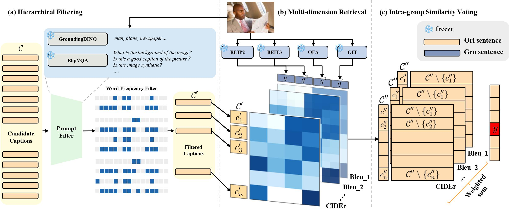

<div align="center">
  <h1>MHE: Multi-dimensional Hierarchical Ensemble Framework for Zero-shot Caption Re-ranking Evaluation</h1>
</div>

<p align="center"></p>

## Result
Our results in **Topic 2: Caption Re-ranking Evaluation**
|CIDEr|SPICE|METEOR|ROUGE_L|Bleu_4|Bleu_3|Bleu_2|Bleu_1|
|:---:|:---:|:---:|:---:|:---:|:---:|:---:|:---:|
|200.70|30.09|34.90|66.60|49.12|58.92|69.94|81.60|

## Setup Environment
- python3.7

```pip install -r requirements.txt```

We overwrite some code in ```pycocoevalcap``` package, please copy all code in ```pycocoeval_eval_overwrite.py``` to replace code in ```site-packages/pycocoevalcap/eval.py```.

## Running

### Quick Mode
By using preprocessed output of retrieval phase and voting phase, you can easily **reproduce** the submission result within a minute. Please run:

```python main.py --mode quick```

### Complete Mode

#### Data preparation
1. Prepare NICE datasets
2. Inference pretrained models 
inference 4 pretrained models('GIT', 'BEiT3', 'OFA', 'BLIP2') on NICE dataset to get query captions.
For your convenience, we provided generated captions in ```datasets/nice/model_output```
3. Extract high-frequency words in candidate captions
We provide preprocessed high-frequency word list in ```datasets/nice/candidate_captions_unfreq_word_mask_top10.json```
4. collect BLIPVQA and GroundingDINO answers for NICE datasets.

#### Main procedure
- [ ] organize code

code is being organizing due to limited of time, we'll update codes as soon as possible!
